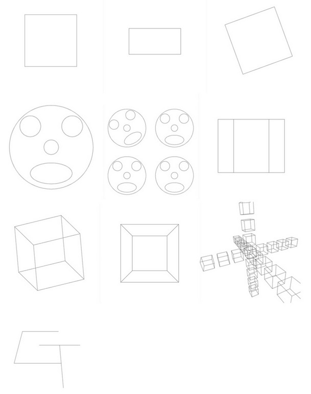

[](https://classroom.github.com/online_ide?assignment_repo_id=5627425&assignment_repo_type=AssignmentRepo)
# Assignment 1b:  Projection and Line Drawing

Goal: implement techniques used in a graphics library that is similar in design to early versions of OpenGL. In particular, I implemented transformation, projection, and mapping to the screen of user-provided lines. 

## Objectives
1. matrix transformation
2. orthographic and perspective projection  
3. calling the `Drawing` `line()` method with the correct transformed values.
4. implement beginShape()` and `endShape()`

## Project Description

The graphics library commands are implemented as methods on the `myDrawing` class in `app.ts`, a subclass of the `Drawing` class defined in `common.ts`.

#### Basic matrix transformations I implemented are: 

- `initMatrix()`
- `translate(x, y, z)`
- `scale(sx, xy, sz)`
- `rotateX(angle)`, `rotateY(angle)`, `rotateZ(angle)`
- `printMatrix()`

#### Projection methods are:

- `ortho(left, right, bottom, top, near, far)`

Orthographic projection. The direction of projection is assumed to be along the z-axis. The `left` and `right` values specify the minimum and maximum x values that will be mapped to the left and right edges of the framebuffer. The `bottom` and `top` values specify the y values that map to the bottom and top edges of the framebuffer. The `near` and `far` values are used to compute the projection matrix, but do not actually clip the content. The eye point is assumed to be facing the negative z-axis.

- `perspective(fov, near, far)`

Perspective projection. The center of projection is assumed to be the origin, and the viewing direction is along the negative z-axis. The value `fov` is an angle (in degrees) that describes the field of view in the `y` (vertical) direction. (Given the vertical `fov` and the width and height of the window, the horizontal field of view can be computed based such that the content retains the correct aspect ratio).  The `near` and `far` values are used to compute the projection matrix, but do not actually clip the content. The eye point is assumed to be facing the negative z-axis.

In OpenGL, the projection and transformation matrices are maintained separately, so you can specify projections at any time before you draw lines and polygons. We will do the same for our assignment. Which ever projection that you specify (`ortho` or `perspective`) will be used until you call a different projection command, and it will be the last operation that is applied to the line endpoints, regardless of where those procedure calls appear with respect to the other transformations.

#### Drawing methods are:

- `beginShape()`, `endShape()`, `vertex(x, y, z)`

The `beginShape()` and `endShape()` commands signal the start and end of a list of endpoints for line segments that are to be drawn. Each call to the routine `vertex()` between these two commands specifies a 3D vertex that is a line endpoint. Black lines are drawn between successive odd/even pairs of these vertices. If, for example, the four vertices v1, v2, v3, v4 are given in four sequential `vertex` commands then two line segments will be drawn, one between v1 and v2 and another between v3 and v4.

The vertices of the lines are first modified by the current transformation matrix, and then by which ever projection was most recently described (`ortho` or `perspective`). Only one of `ortho` or `perspective` is in effect at any one time. These projections do not affect the current transformation matrix, nor are they affected by the `initMatrix` command, and should be maintained as a separate matrix! Your `beginShape`, `vertex` and `endShape` commands must be able to draw any number of lines. You can draw the lines as soon as both vertices are given to you (using `vertex`), or you can store all of the vertices and draw all of the lines when `endShape` is called. Which way you use is up to you. To draw the lines, use the `line()` method on the `Drawing` object.

# Provided Code 
resources: https://github.com/cs3451-f21/a1-b-projection-and-line-drawing-chelliy  from Georgia Tech course CS3451

# Results

Below are the results that your program should draw when you press the 1-9 and the 0 keys. As with 1 A, we are providing these tests to help you check that your implementation is correct. Note that you will use your own initials for the final image, and you must clearly demonstrate that this image was created using perspective projection.  

The results shown below were rendered in a square window.  If the window is not square, the orthographic projection will stretch the content to fill the window, while the perspective projection should keep the correct aspect ratio (squares will remain square) and window height, but show more/less of the horizontal view depending on if the window is wider (more) or narrower (less) than the height.



# Authorship Rules

Other than the base code, the rest is indivudual work and entirely my own.

# Compile and Run

1. cd into the directory and run ```npm install```
2. run with ```npm run dev```
3. visit ```http://localhost:3000/index.html```

